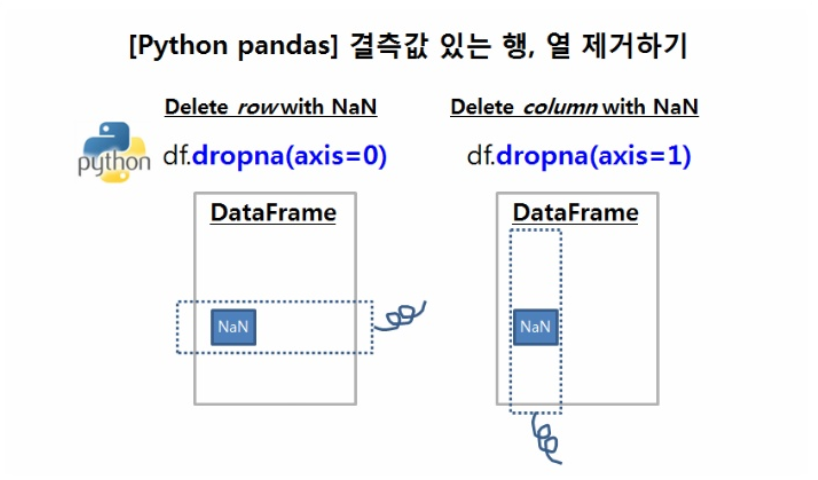

### 누락값 처리하기

> 누락값 삭제하기

- dropna 메서드

**dropna()**

누락값이 포함된 행을 모두 삭제

**dropna(how='all')**

모든 행이 누락값일 때만 삭제


/ **default가 row**이므로 column에 대해 적용해주려면

**dropna(axis=1)**

누락값이 포함된 열을 모두 삭제

**dropna(axis=1, how='all')**

모든 열이 누락값일 때만 삭제

___


axis=0 이면 '행' / axis=1 이면 '열'




```
**default axis=0**,, thresh=3이 의미하는 바는?

각 row에서 NaN이 아닌 값이 최소 3개 이상 나와야 한다
그것보다 적게 나온다면 row를 제거
마찬가지로 column은 axis=1을 설정하고 적용
```