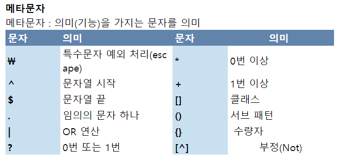
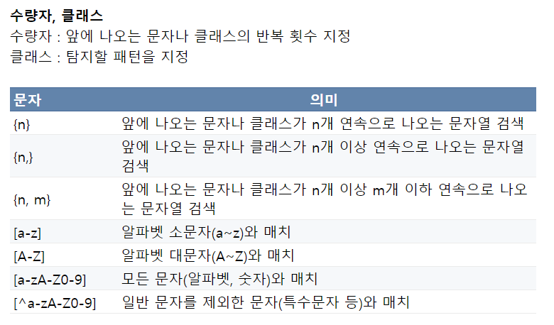
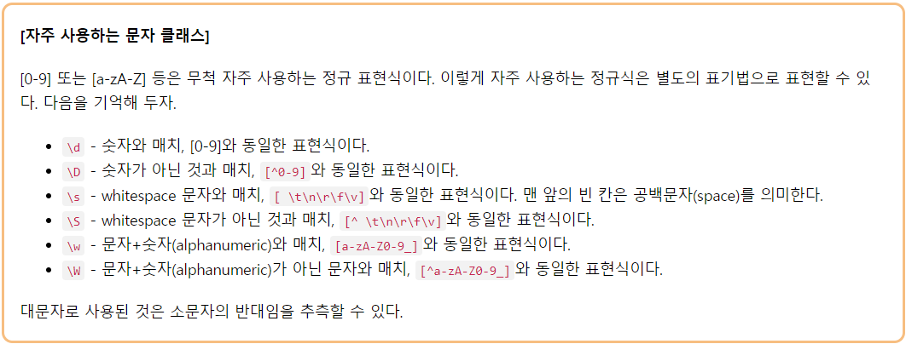
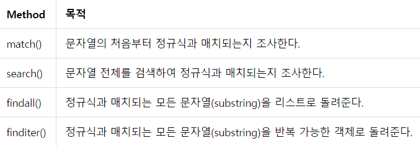

### 문자열 처리하기

> if문 한줄에 작성

ex)

```python
condition = True

if condition:
    X = 1
else:
    X = 0
print X
```

결과는 1

```python
condition = False

if condition:
    X = 1
else:
    X = 0
print X
```

결과는 0


한줄에 작성방법

```python
condition = True
X = 1 if condition else 0
print X
```

결과는 1

```python
condition = True
X = 1 if condition else 0
print X
```

결과는 0


> 포매팅 함수 한줄에 작성

```python
var = 'flesh wound' 
s = "It's just a {}!"

print(s.format(var))
```

결과는 It's just a flesh wound!

```python
print(s.format('scratch'))
```

결과는 It's just a scratch!


한줄에 작성방법(python 3.6 이상에서 지원)

```python
var = 'flesh wound' 
s = f"It's just a {var}!"

print(s)
```

결과는 It's just a flesh wound!


f - string는 str.format과 다르게 정수끼리의 산술 연산도 지원

f - string 선언을 먼저 한 후 변수를 나중에 선언하는 형식 또한 가능


> 기본 정규식 문법

- Python re 라이브러리

regular expression(정규 표현식)의 약자. 정규 표현식을 사용하여 문자열에서 특정 패턴이 포함된 문자열을 검색할 수 있다.


 https://wikidocs.net/4308  참고


***기본 정규식 문법***

| 문법   | 설명                                                         |
| ------ | ------------------------------------------------------------ |
| .      | 문자 앞에 문자 1개가 있는 패턴을 찾음                        |
| ^      | 문자열의 처음부터 일치하는 패턴을 찾음                       |
| $      | 문자열의 끝 부분부터 일치하는 패턴을 찾음                    |
| *      | n 이후 숫자(\d)가 0개 이상인 패턴을 찾음                     |
| +      | n 이후 숫자(\d)가 1개 이상인 패턴을 찾음                     |
| ?      | ?의 앞의 문자가 있거나 없는 패턴을 찾음                      |
| {m}    | n 이후 숫자(\|d)가 2개{{2}}인 패턴을 찾음                    |
| {m, n} | n 이후 숫자(\|d)가 2개{{2}} 이상, 4개{{4}} 이하인 패턴을 찾음 |
| \      | *, ?, +와 같은 특수문자를 검색할 때 이스케이프 문자를 사용   |
| []     | c, f, h(임의의 문자) 중 1개를 포함하고 나머지 문자열이 all인 패턴을 찾음 |
| \|     | 두개의 문자열 중 하나만 있는 패턴을 찾음(OR연산)             |
| ()     | ()에 지정된 패턴을 찾을 때 사용                              |







***정규식 특수문자***

| 특수 문자 | 설명 |
| --------- | ---- |
| \d       | 숫자 1개를 의미 ([0-9]와 동일) |
| \D | 숫자 이외의 문자 1개를 의미 (^0-9와 동일) |
| \s | 공백이나 탭 1개를 의미 |
| \S | 공백 문자 이외의 문자 1개를 의미 |
| \w | 알파벳 1개를 의미 |
| \W | 알파벳 이외의 문자 1개를 의미 (한글, 중국어 등) |



***대문자를 사용하면 ''해당 표기 외', 제외하고' 이다***

https://regex101.com 에서 정규식 패턴 결과를 바로 확인할 수 있다(실습)



***정규식 메서드***

| 함수      | 설명                                                         |
| --------- | ------------------------------------------------------------ |
| search    | 첫 번쨰로 찾은 패턴의 양 끝 인덱스를 반환                    |
| match     | 문자열의 처음부터 검색, 찾아낸 패턴의 양 끝 인덱스를 반환    |
| fullmatch | 전체 문자열이 일치하는지 검사                                |
| split     | 지정한 패턴으로 잘라낸 문자열을 리스트로 반환                |
| findall   | 지정한 패턴을 찾아 리스트로 반환                             |
| finditer  | findall 메서드와 기능이 동일하지만 iterator를 반환           |
| sub       | 첫 번째 인자로 전달한 값(패턴)을 두 번째 인자로 전달한 값(easyspub)으로 교체 |


\d\d\d\d\d\d\d\d\d\d  =  \d{10}


### 10장 apply 메서드 활용

***apply 메서드는 사용자가 작성한 함수를 한 번에 데이터프레임의 각 행과 열에 적용하여 실행할 수 있게 해주는 메서드***

대용량의 데이터를 처리할 때는 apply 메서드가 for문보다 더 빠르다

