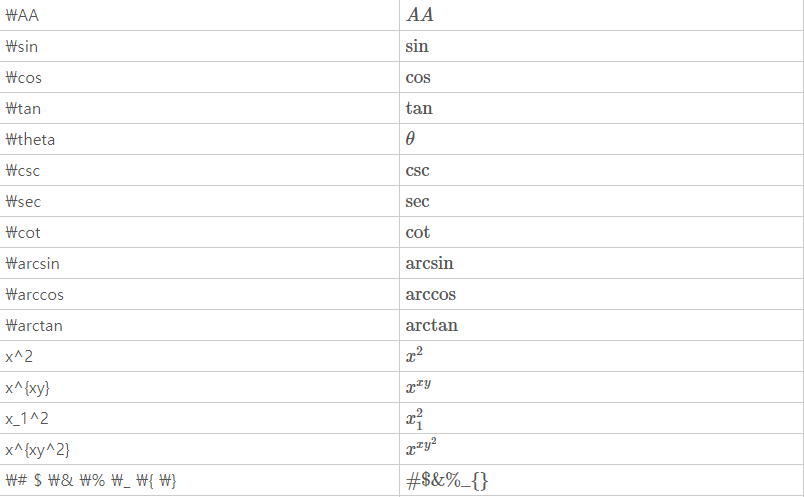
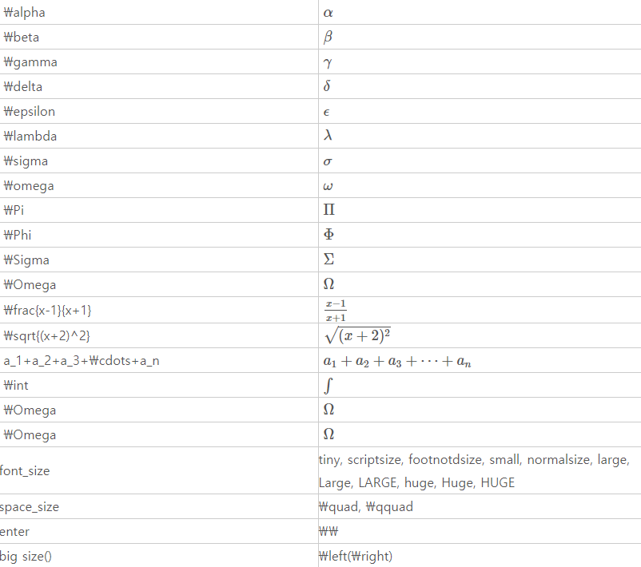
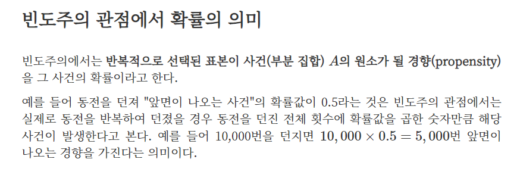
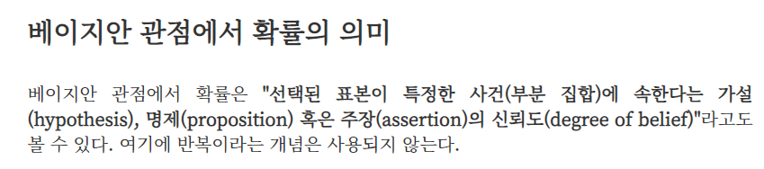

#### 순열과 조합

> 합의 법칙

A와 B가 동시에 일어나지 않을 때

> 곱의 법칙

A와 B가 동시에 일어날 때

순열과 조합

___

> 원 순열

(n-1)!


> 중복 순열

서로 다른 n개의 **중복을 허용**하고 r개를 택하여 일렬로 나열하는 방법

> 조합

서로 다른 n개에서 **순서를 생각하지 않고** r개(0<= r <= n)를 택하는 것

> 이항정리

파스칼의 삼각형 생성 뚜둔!

> 조합의 점화식

> 중복조합

서로 다른 n개의 **중복을 허락**하여 r개를 택하는 조합

$$
nHr = n+r-1Cr
$$

> MathJax 문법





> 정리

$$
nPr: 중복 허락하지 않지만 순서는 생각한다

n\Pi r: 중복을 허락하고 순서도 생각한다

nCr: 중복을 허락하지않고 순서도 생각하지 않는다
$$


6명을 A, B, C의 세 팀으로 2명씩 나누는 방법의 수
$$
6C2 * 4C2 * 2C2
$$
여자 6명, 남자 4명 중에서 4명을 선출할 때, 적어도 남자 1명이 포함되는 경우의 수
$$
10C4 - 6C4
$$

___

#### 확률

```
- 시행: 동일한 조건에서 여러 차례 반복할 수 있는 실험이나 관찰
- 표본공간(S): 어떤 시행에서 일어날 수 있는 모든 가능한 결과의 전체집합
- 사건(A): 표본공간의 부분집합
- 전사건(U):표본공간 자신의 집합(반드시 일어나는 사건)
- 공사건():결코 일어나지 않는 사건
- 합사건:A 또는 B가 일어날 사건
- 곱사건:A와 B가 동시에 일어날 사건
- 배반사건: 두 사건 A와 B의 교집합이 공집합인 A와 B를 서로 배반사건이라고 한다
- 여사건: A의 여집합 사건 A에 대하여 A가 일어나지 않는 사건을 A의 여사건이라 한다
```

> 확률의 정의

하나의 사건이 일어날 수 있는 가능성을 수치로 나타낸 것

사건 A가 일어날 확률을 P(A)로 나타낸다.

> 확률의 덧셈정리

> 조건부확률

> 독립사건, 종속사건

> 확률의 곱셈정리

> 독립사건의 곱셈정리

> 독립시행

> 이항확률분포 / 이항정리

> 독립시행의 확률

어떤 시행에서 사건 A가 일어날 확률이 p이고, 그 여사건이 일어날 확률 q(q= 1-p)일 때,

n번의 독립시행에서 사건 A가 r번 일어날 확률은

$$
pr = nCrp^rq^n-r (r= 0,1,2, ,n)
$$


> 빈도주의



반복적으로 선택된 표본이 사건(부분 집합) A의 원소가 될 경향(propensity)을 그 사건의 확률이라고 한다

ex) 동전을 던져 "앞면이 나오는 사건"의 확률값이 0.5

모수(parameter) = 미지의 수 // 절대 진리

내가 관찰한 표본 통계량

>  베이지안주의



___


>기술통계

- 대표값(대표지표 -위치지표)
- 산포(다양성, 변이) 지표


> 중심위치의 척도

산술평균 또는 평균

산술평균은 모든 관측치들을 합하고 관측치의 수로 나누어서 계산한다

> 산술평균
```
- 분포의 집중도를 나타내는 중심개념을 말하는데 간단히 말해 평균이라고 한다.

- 산술평균은 측정데이터(예: 키, 점수 등)의 중심위치를 나타내는데 적정한 척도이다.

- 산술평균은 "이상치(outliers)"라고 부르는 극단값들에 의해 크게 영향을 받는다.

  ex) 억만장자가 이웃으로 이사오면 평균가계소득이 크게 증가한다
```

> 중앙값

```
- 중앙값(median)은 모든 관측치를 순서대로 정렬할 때 중심에 있는 관측치를 의미한다
- 중앙값은 숫자로 표시되는 양적자료에만 사용
- 이상치(outliers)의 영향을 받지않는다
-  
```

최빈값 mode

중간값 median

평균 means