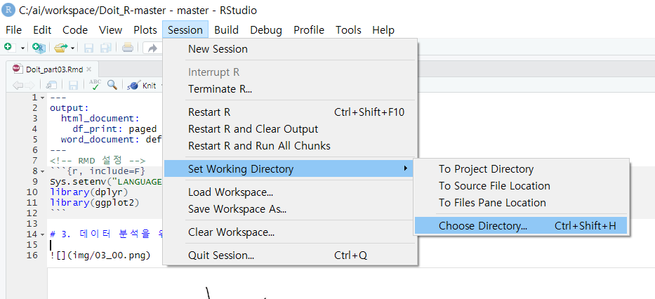

### R

> R이란?

데이터 분석 S/W

- In-Memory Computing으로 H/W 메모리에 따라 빠른 처리 속도

프로그래밍 언어

- 객체 지향 / 구조화 / 모듈화 / 패키지
- 데이터와 변수(객체)의 선언,  handing function

개발환경(CRAN)

- 데이터 입출력, 처리, 관리, 그래픽
- 최신 알고리즘 및 라이브러리 패키지 제공

Community

- 가장 최신의 분석 알고리즘을 가장 빨리 적용
- SPSS with R: 확장 모듈로 R 제공

> R tools

R 통합 개발 툴

- R Studio
- Rattle
- Revolution R
- Rcommender

___

R Working Directory 바꾸기

getWD() / setWD()

패키지::함수명

::로 패키지 내의 어떤 함수를 사용할지 명명할 수 있다

