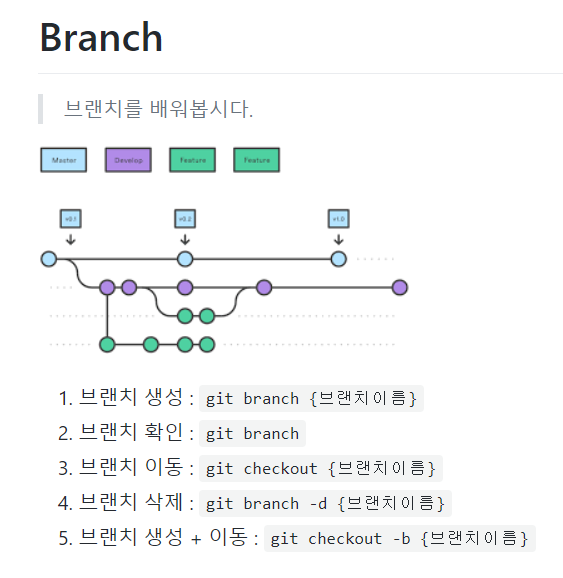

### 191211

git push origin master --force

억지로 밀어넣기


> branch 명령어


```
branch 만들기
'git branch name/function' 이름/기능(관례) 가지 만들기
'git branch' 만든 가지 확인하기
'git checkout name/function' master 또는 만든가지 변경
ex) master에 위치하다가 oh라는 가지로 이동하고 싶을 때
'git checkout oh'
add, commit, push 과정 동일
branch 삭제하기
'git branch -D name/function' master에서 명령어 입력
branch에서 push
'git push origin 브랜치 이름'
```

### Branch

> 브랜치를 배워봅시다.

1. 브랜치 생성: `git branch 브랜치이름`
2. 브랜치 확인: `git branch`
3. 브랜치 이동:  `git checkout 브랜치이름`
4. 브랜치 삭제:  `git branch -d 브랜치이름`
5. 브랜치 생성 + 이동: `git checkout -b 브랜치이름`



___

### PYTHON 기초

> python이 떠오른 이유

최초 tensorflow가 python으로 사용 뚜둔


``파이썬 챗봇``

https://py.hphk.io/ 


**프로그래밍 언어: 3형식**
```
1. 저장

2. 조건(if)

3. 반복(while)
```
**python 주의사항**
```
1. 대/소문자

2. 띄어쓰기

3. 스펠링
```
___

list print hello("숫자")

dictionary print hello("문자")

___

**python data type**

string, int, boolean

**API**

Application Programing interface

___

공공데이터 포털

 https://www.data.go.kr/ 

___

print(f"{name}님 안녕하세요")

format 함수없이도 (f"{}") 안에 작성 가능

